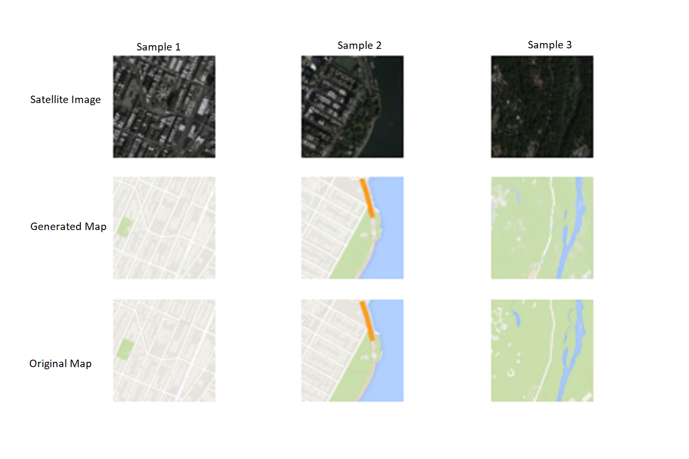
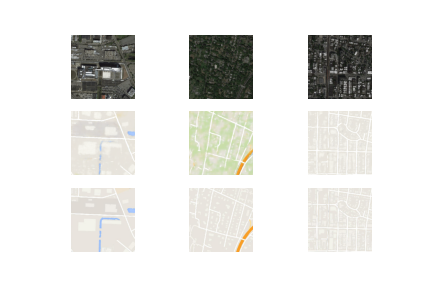

# Satellite-Images-to-Map-Layer-Translation-Using-Conditional-Patch-GAN
Generation of Map layer is extremely helpful for visual ease and navigation layer. As can be seen in Google Maps, they provide many layers for convinience of a user. Out of them, the most used layers are satellite imagery and default map layer. In this work, we attempt to generate automatic map layer from satellite imagery. We enforce a conditional GAN with a patch GAN discriminator for generating realistic map layer with crisp higher frequency details. 

We also selected a L1 loss function to address the lower frequency details in the output. This work is inspired by the pix2pix model. [[**Paper**]](https://arxiv.org/abs/1611.07004v3)

All the models are developed in keras and can be easily extended to other domains. 

The dataset used for this experiment can be found [**here**](http://efrosgans.eecs.berkeley.edu/pix2pix/datasets/maps.tar.gz)

Here is the model's performance after 109600 epochs. 

As can be seen in this sample, the model seems to correctly generate the vegetation layer as opposed to the false ground truth.

